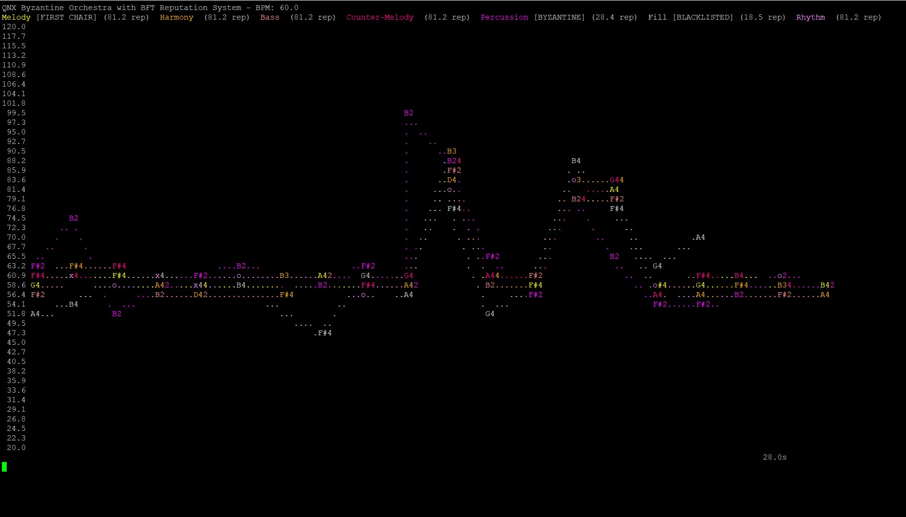

# QNX Byzantine Orchestra

A real-time distributed consensus simulation implemented on QNX Neutrino RTOS, demonstrating Byzantine Fault Tolerance principles through a musical orchestra metaphor. This project showcases QNX IPC mechanisms, real-time scheduling, and consensus algorithms in a multi-threaded environment with live visualization.

## Overview

The Byzantine Orchestra simulates a conductor coordinating multiple musicians in real-time, where some musicians may be Byzantine (malicious) actors. The system implements a reputation-based consensus mechanism to maintain synchronization despite the presence of faulty nodes with QNX message passing for inter-process communication.

### Key Features

- **Real-time QNX Implementation**: Uses QNX Neutrino's message passing (`MsgSend`/`MsgReceive`) and real-time scheduling (`SCHED_FIFO`)
- **Byzantine Fault Tolerance**: Supports up to `n` Byzantine musicians in a `3n+1` total musician configuration
- **Reputation System**: Dynamic trust management with consensus-based voting and reputation decay
- **Live Visualization**: Real-time ASCII-based performance monitoring with coloured output
- **Configurable Orchestra**: Support for 4-7 musicians with musical piece selection

## Architecture

### Core Components

#### Conductor Thread (`conductor.c`)
- **Priority**: `SCHED_FIFO` with priority 50
- **Responsibilities**: 
  - Pulse generation and BPM management with random tempo changes (50% chance every 4 pulses)
  - Musician report collection with timeout (`REPORT_TIMEOUT_SECONDS`)
  - Reputation processing and blacklist management
  - Trusted musician consensus averaging using `last_reported_bmp` values

#### Musician Threads (`musician.c`)
- **Timing Model**: Microsecond-precision timing using `clock_gettime(CLOCK_MONOTONIC)`
- **Behavior Types**:
  - **Normal**: ±5% BPM tolerance (`BPM_TOLERANCE`)
  - **First Chair**: ±2% maximum deviation (`FIRST_CHAIR_MAX_DEVIATION`)
  - **Byzantine**: ±20% intentional deviation (`BYZANTINE_MAX_DEVIATION`) with 50% activation chance

#### Reputation System (`reputation.c`)
- **Thread Safety**: Protected by `pthread_mutex_t reputation_mutex`
- **Scoring Algorithm**: Deviation-based behaviour scoring with exponential penalties
- **Consensus Voting**: 70% threshold for reputation changes (`CONSENSUS_THRESHOLD`)
- **Blacklisting**: Automatic removal at threshold (20.0 standard, 10.0 first chair)
- **Decay**: Applied every 4 pulses with 0.95 multiplier (`REPUTATION_DECAY_RATE`)

#### Visualization (`visualization.c`)
- **Real-time Display**: 50ms refresh rate (`REFRESH_INTERVAL_MS`)
- **Bresenham Algorithm**: Optimized line drawing for musician trajectory visualization
- **Color Coding**: 7 distinct ANSI colours with blacklist indication in grey
- **Window Management**: 20-second sliding time window with 175x45 character display

### QNX-Specific Implementation Details

#### Message Passing Architecture
```c
typedef struct {
    int type;                    // 1 = pulse, 2 = report, 3 = reputation_vote
    int musician_id;
    double reported_bmp;
    double reputation_score;
    int target_musician_id;
    bool is_vote_negative;
} pulse_msg_t;
```

#### Channel/Connection Setup
- **Conductor Channel**: `ChannelCreate(0)` for receiving musician reports
- **Musician Channels**: Individual channels for pulse reception
- **Connection Objects**: Bidirectional COIDs for conductor-musician communication

#### Real-time Scheduling
```c
pthread_attr_setschedpolicy(&attr, SCHED_FIFO);
param.sched_priority = PRIORITY_CONDUCTOR;
pthread_attr_setschedparam(&attr, &param);
```

## Building and Running

### Prerequisites
- QNX Neutrino 7.0+ RTOS
- QNX SDP with `qcc` compiler
- Terminal supporting ANSI colour codes

### Build Instructions
```bash
cd qnx-byzantine-orchestra

make
```

### Execution
```bash
./bin/byzantine_orchestra <num_musicians>
```

## Configuration Parameters

### Timing Constants
```c
#define DEFAULT_BPM 60                    // Starting tempo
#define MIN_BPM 40                        // Minimum allowable BPM
#define MAX_BPM 100                       // Maximum allowable BPM
#define BPM_TOLERANCE 0.05                // ±5% normal musician tolerance
#define BYZANTINE_MAX_DEVIATION 0.20      // ±20% Byzantine deviation range
#define FIRST_CHAIR_MAX_DEVIATION 0.02    // ±2% first chair precision
#define BYZANTINE_BEHAVIOR_CHANCE 0.5     // 50% chance of Byzantine behaviour
```

### Reputation System
```c
#define INITIAL_REPUTATION 100.0          // Starting reputation score
#define BLACKLIST_THRESHOLD 20.0          // Standard blacklist threshold
#define FIRST_CHAIR_THRESHOLD 10.0        // First chair blacklist threshold
#define REPUTATION_DECAY_RATE 0.95        // Per-measure decay factor (every 4 pulses)
#define CONSENSUS_THRESHOLD 0.7           // 70% voting threshold
#define GOOD_BEHAVIOR_REWARD 1.0          // Positive reputation adjustment
#define BAD_BEHAVIOR_PENALTY 15.0         // Negative reputation penalty
#define EXTREME_BEHAVIOR_PENALTY 25.0     // Severe deviation penalty
```

### Performance Parameters
```c
#define MAX_PULSES 32                     // Concert duration in pulses
#define REPORT_TIMEOUT_SECONDS 5          // Musician response timeout
#define REFRESH_INTERVAL_MS 50            // Visualization refresh rate
#define MICROSECONDS_PER_MINUTE 60000000.0 // Timing calculation constant
```

### Visualization
```c
#define DISPLAY_WIDTH 175                 // Character width of visualization
#define DISPLAY_HEIGHT 45                 // Character height of visualization
#define MAX_HISTORY 500                   // Maximum stored note events
```